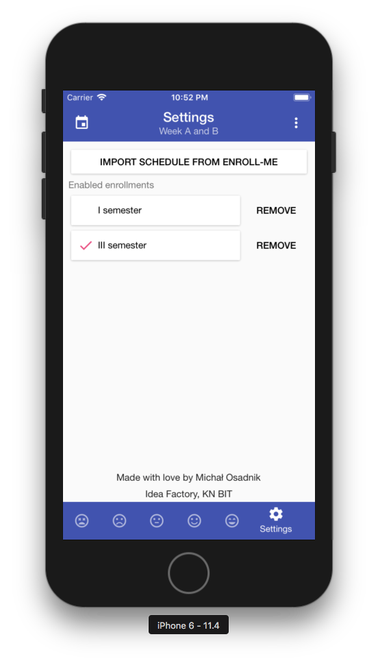
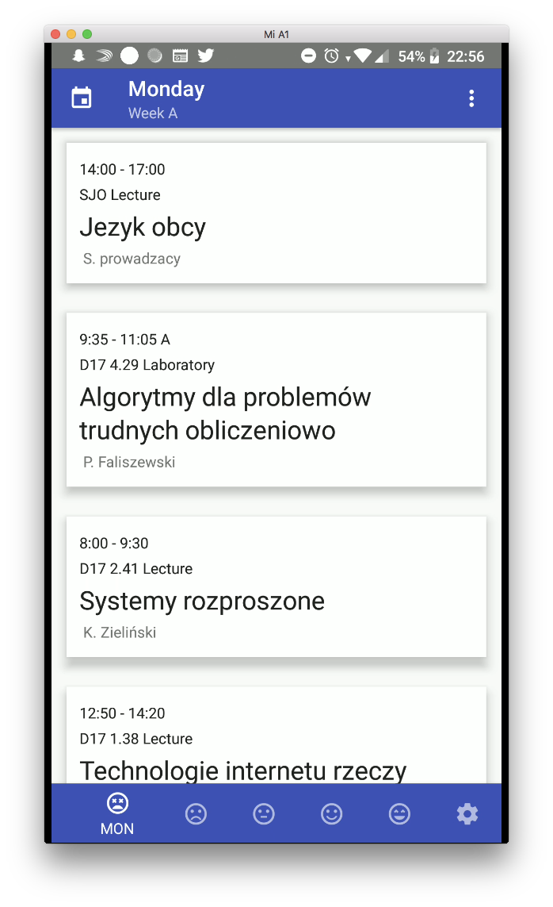

# Enroll-me
Enroll-me is internal tool for students of Faculty of Computer Science, Electornics and Telecomunication. 

This tool is an offline previewer which allows to look-up schedule and import enrollment (via static website's analize)

PRs and issues are very welcome! 
Release soon!

## Screens




## Development

**Step 1:** clone repo & cd into project

**Step 2:** install node modules

```
yarn
```

*Before run android build, setup [Android Studio](https://facebook.github.io/react-native/docs/android-setup.html)*

**Step 3:** If Android

```
react-native run-android
```

*Before running iOS build, Install [Xcode](https://developer.apple.com/xcode/download/)*

**Step 4:** If iOS

```
react-native run-ios
```

That's all

If you want to install app in the device, connect your device to the system with debugger mode on and run the above command (app will be installed automatically)
